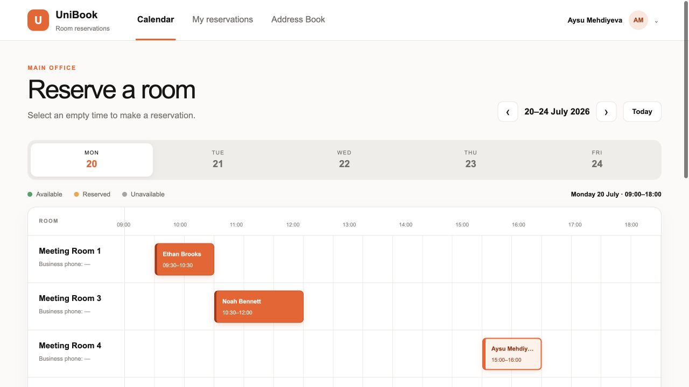

# UniBook Room Reservation

UniBook is a student-built web application prototype for reserving meeting rooms in a shared office. Employees can see available and reserved time slots, make reservations without collisions, view their own meetings, and find coworkers in an address book. Administrators can manage room availability and access rules.

I am building this project step by step as a CTIS student at Bilkent University.

## Author

**Aysu Mehdiyeva**  
GitHub: [@aysumehdiyeva](https://github.com/aysumehdiyeva)  
CTIS student at Bilkent University

## Interface Preview



## Current Features

- Work-week calendar from 09:00 to 18:00
- Clear available, reserved, restricted, and unavailable room states
- Collision prevention for overlapping bookings
- Personal reservation view
- Employee address book and profile details
- Different room access rules for employees, departments, and administrators
- Room closure reasons, such as maintenance or repair
- Admin controls for adding, editing, hiding, and reopening rooms
- Responsive layout for desktop and smaller screens
- Prototype login and logout flow

## Latest Milestone: Secure Prototype Sessions

- Added HTTP-only demo session cookies
- Removed client-supplied admin roles from reservation APIs
- Centralized room-access and cancellation rules
- Split login, Address Book, and admin interfaces into separate components
- Added automated collision and permission tests

## Authentication Plan

The current login screen is a prototype account selector for demonstrating user roles and room permissions. A production deployment should use the organization’s Microsoft Entra ID work accounts. Authentication and authorization must be verified on the server before the system is used with real employee data.

## Privacy

This public repository contains fictional employee names, example email addresses, and sample phone extensions. It does not contain a real employee directory, private credentials, production tokens, or the hosted project identifier.

## Technology

- TypeScript
- React and Next.js-compatible routing through Vinext
- Cloudflare Workers
- Cloudflare D1 / SQLite
- Drizzle schema definitions
- CSS with responsive layouts

## Project Structure

```text
app/
  api/state/route.ts   API and database operations
  globals.css          Application styles
  layout.tsx           Page metadata and root layout
  page.tsx             Calendar and interface components
db/
  index.ts             Database connection helper
  schema.ts            Employee, room, and booking tables
public/
  favicon.svg          UniBook browser icon
worker/
  index.ts             Cloudflare Worker entry point
build/
  sites-vite-plugin.ts Build adapter
```

## Run Locally

Requirements: Node.js 22.13 or newer.

```bash
npm install
npm run dev
```

Create a production build with:

```bash
npm run build
```

## Development Roadmap

- [x] Design the work-week reservation calendar
- [x] Add room availability and collision prevention
- [x] Add personal reservations and employee profiles
- [x] Add access rules for restricted rooms
- [x] Add administrator room management
- [x] Add the prototype login and logout experience
- [ ] Connect Microsoft Entra ID authentication with IT approval
- [ ] Import the approved employee directory securely
- [x] Add server-side role and permission enforcement
- [x] Add automated tests for booking conflicts and access rules
- [ ] Complete security and accessibility reviews

## Project Status

Active student project. The interface and reservation workflow are being improved step by step. This repository is a portfolio-safe demonstration and is not an official Unibank production system.
